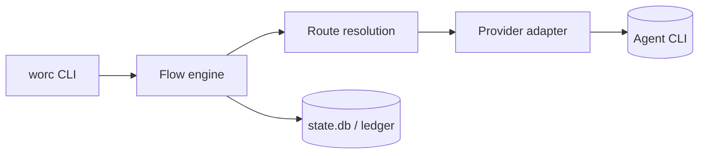

<!-- HOW the solution is built, in enough detail to implement without re-deciding. Must honor the hard
     invariants (AGENTS.md and .agents/rules/*). Record heavy decisions inline: context, options, why. -->

# Design — {{TASK_TITLE}}

Satisfies [requirements.md](requirements.md).

## Overview

<!-- The approach in a paragraph: the shape of the solution as one slice from the CLI verb through the
     engine to whatever it writes. -->

## Key decisions

<!-- Any decision with real trade-offs: the context or constraint, the choice stated plainly ("We
     will …"), what was rejected and why, and whether it comes close to a hard invariant. The rules
     win on conflict — if the design needs one bent, that is an open question, not a decision. -->

## Layers touched

<!-- Only the rows that change; delete the rest. Keep the direction of dependency intact — the core
     never learns provider CLI syntax, and `lint-imports` enforces the boundaries. -->

| Layer | What changes |
| --- | --- |
| `cli.py` / `cli_shell.py` |  |
| `core/` (orchestrator, state machine, flow engine, prompts) |  |
| `providers/` |  |
| `routing/` |  |
| `git_manager.py` |  |
| `state_store.py` / `ledger.py` |  |
| `config/` |  |
| `security/` |  |
| `packaged/` (flows, role prompts, guide, `config.example.yaml`) |  |
| `tests/` |  |

## Control flow & state

<!-- Where the change sits in the task lifecycle: which statuses and transitions it touches, what it
     does on re-entry or resume, and what happens when the process dies mid-way. Name the real
     statuses and node ids — do not invent them. -->

## Data & stored shapes

<!-- New or changed config keys (with defaults and the schema version bump), `state.db` tables and
     columns, `.worc/` files and layout, artifacts the run leaves behind. Say what an existing
     installation sees; greenfield means no migration path unless the task asked for one. -->

## Provider & prompt surface

<!-- If a provider is involved: which adapter, what argv it builds, the flag ceiling it must respect,
     the model/reasoning resolution. If a prompt is involved: which role prompt or template, which
     variables, and how the content reaches the agent (a file path, never argv). -->

## Failure classes & routing

<!-- Which failures are the provider's infrastructure classes (the only ones that may fall back) and
     which route to `fixing` / `failed` / `manual_action_required`. State what is retried, how often,
     and what the operator sees when it stops. -->

## Security & isolation

<!-- What the change exposes: paths written, env vars passed (allowlisted only), argv built without
     shell interpolation, secrets kept out of logs/SQLite/artifacts, and the behavior at each value
     of `security.strict_isolation`. -->

## Cross-platform

<!-- Windows / Linux / macOS by construction: `pathlib` and `Path.as_posix()` for stored, compared or
     displayed paths; `newline=""` (or bytes) for committed and templated files; no `os.kill` /
     signal assumptions for cross-process control. Branch platform differences explicitly. -->

## Observability

<!-- What the run records so the outcome can be explained afterwards: ledger entries, node logs,
     prompt audit, `state.db` rows, the report bundle. -->

## Tests

<!-- The seams that get unit tests, and the integration coverage that needs deterministic fake CLIs
     (never the real Codex/Claude binaries). Name the platform-specific cases. -->

## Doc impact

<!-- Which documents on this branch must change with the code: `.agents/rules/`, `README.md`, and the
     shipped operator-facing copies under `src/wastech_orchestrator/packaged/` (the guide, the flows
     and role prompts, `config.example.yaml`). Note the derived pages that live only on the
     documentation branch in plain text, as a breadcrumb for that separate task. -->

## Diagram

