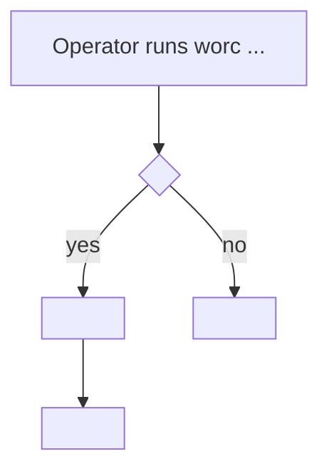
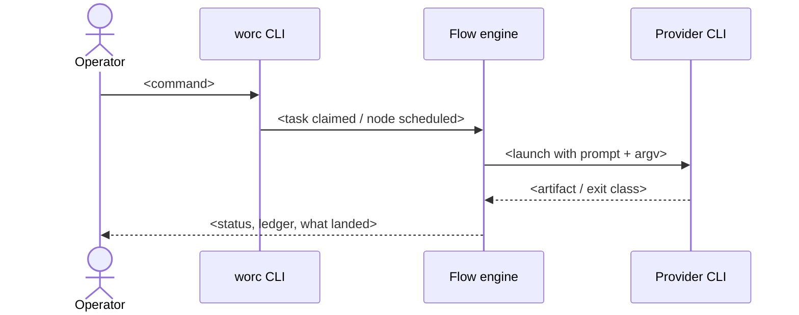

<!-- The task made concrete for a NON-technical reader: what the operator does, sees, and gets.
     Plain language, Before/After, and small Mermaid diagrams. If you can't tell this story simply,
     the requirements aren't clear yet — go back. -->

# Happy path — {{TASK_TITLE}}

## In one sentence

<!-- "An operator who <situation> can now <do the thing> and gets <result>." -->

## Before / After

|  | Before (today) | After (this task) |
| --- | --- | --- |
| What the operator types |  |  |
| What the run does |  |  |
| What lands (branch / PR / artifacts / state) |  |  |

## Example 1 — `<short scenario name>`

<!-- Walk one real run through it, step by step, in plain language. Name the actual command, the flow
     and the nodes it passes, and what the operator sees at the end. -->

1. …
2. …
3. …

## Example 2 — `<another scenario, e.g. the failure the operator hits today>`

1. …

## Run flow

## Before → After (sequence)

<!-- Keep diagrams small and honest. Two clear diagrams beat one sprawling one. -->
