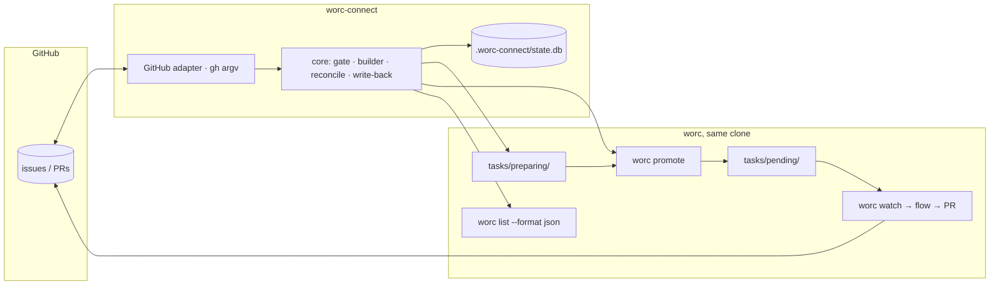

# Design — Tracker connector

Satisfies [requirements.md](requirements.md). The connector, `worc-connect`, lives in its own repository; the two worc-side items live here. Both halves are designed in this one document so the contract between them is visible from either side.

## Overview

`worc-connect` is a host process that runs beside `worc watch` in the same clone. Each tick it asks a `TrackerAdapter` for the open work items updated since a watermark, keeps the ones an explicit gate admits, and for each new one allocates a task id and a branch name, writes a task file into worc's `tasks/preparing/`, and promotes it with the `worc promote` command. On every tick it also reconciles the items it already handed off — from `worc list --format json` for the task's status and from the code host for the pull request on the branch it named — and writes the result back to the tracker as a state label and a comment. The core sees only a normalized `WorkItem`; the GitHub adapter is a thin wrapper over `gh`. Triage is a second, optional path through the same machinery: the item first becomes a worc _triage_ task, and the task builder then runs on the report instead of on the raw item.

The shape mirrors worc's own architecture on purpose: a core that knows no external syntax, adapters that know one thing each, deterministic code deciding what a model may only propose.

## Key decisions

### D1 — A separate package; the core knows no tracker API

**Context.** The operator wants GitHub now and Azure DevOps / GitLab / Jira later, with one workflow and adapters users install on demand; nothing tracker-specific may ship with worc.

**Decision.** One repository, `worc-connect`, with a tracker-agnostic core and adapters behind optional dependencies (`worc-connect[github]`, later `[gitlab]`, `[azure]`), discovered through an entry-point group (`worc_connect.trackers`). Adapters live in the same repository for v1 — one CI, one version, an interface still allowed to move — with the entry-point group in place from day one so a third-party adapter, or a later split into per-tracker repositories, needs no core change.

**Rejected.** Building it inside worc behind an extra: couples releases, ships tracker code to every operator, and tempts the connector to reach into `state.db`. One repository per tracker from the start: release coordination before the interface exists.

### D2 — `gh` is the GitHub transport; the connector holds no token

**Decision.** The GitHub adapter shells out to `gh` — `issue list --json`, `issue view --json`, `issue edit --add-label/--remove-label`, `issue comment --body-file`, `issue close --comment`, `pr list --head --state all --json`, `label create` — every call an argument list, every call pinned with `--repo OWNER/REPO` from the connector's configuration (the same defence worc applies in `GitManager._gh`). Authentication is the operator's `gh auth login`, exactly as worc requires it for its own PRs.

**Rejected.** REST/GraphQL with a PAT or App token: more control, but it introduces a credential worc deliberately keeps outside itself. Webhooks: a public endpoint for a local tool. Both stay open for a v2 adapter behind the same interface.

### D3 — The poller is deterministic; a model runs only inside worc

**Decision.** The polling loop makes no model call. Everything an agent should do — analyse, reproduce, write a failing test — is a worc task the connector queues, so it runs inside worc's sandbox with worc's providers, fallback, containment, HITL and audit trail. The connector never launches Claude Code or Codex.

**Why.** The operator's first framing was "an agent session every five minutes that watches issues". That spends budget on nothing and adds non-determinism where reliability is the whole point. It is also the memory campaign's verdict applied again: the model proposes, deterministic code decides.

### D4 — Handoff through the public ingress only

**Decision.** The connector writes exactly one kind of thing into the clone: a task file in `tasks/preparing/` (worc's documented staging area, which the watch scanner never reads), written atomically (temp file + `os.replace`, UTF-8, `newline=""`), then moved by `worc promote <id>` — launched as an argv list, the `worc` executable resolved with `shutil.which`. It never writes into `tasks/pending/`, never runs `git`, never reads `state.db`.

**Why.** `promote` is the atomic, refuse-to-overwrite step worc built for exactly this race. The audit commit stages only the task's own lifecycle file, so a staged file is never swept into a commit (`GitManager.commit_audit`) — and since 2026-09-10 `worc install` gitignores the whole lifecycle tree by default (`/tasks/`, anchored; the operator deletes one line to track it), in which case the audit commit is skipped entirely and nothing under `tasks/` is ever committed. A file in `preparing/` is untracked either way and survives worc's branch checkouts. The connector therefore coexists with the single processing slot without knowing it exists.

**Rejected.** Committing the task file to the base branch for the watch tick to discover: works, is the remote-connector path, but needs push rights to a protected branch and a second clone — deferred.

### D5 — The connector owns its home: `.worc-connect/`

**Decision.** State (SQLite), the connector log and its config live under `<repo>/.worc-connect/`; `worc-connect init` appends that directory to the tracked `.gitignore` the way `worc install` appends `.worc/` and `.worc-io/` (`RUNTIME_GITIGNORE_LINES` in `git_manager.py`, probe-per-root so an existing line is never duplicated).

**Why.** `.worc/` is the orchestrator's private _control_ home — frozen control bundles, `state.db`, a provider-denied root. A foreign process writing a cache of **untrusted issue text** inside the orchestrator's control home blurs a boundary worc spent effort drawing. worc already runs two sibling homes, so a third is the established pattern. Confirmed by the user (Q-2).

### D6 — Labels are the visible state machine; local state is a cache

**Decision.** Six connector-owned states — `queued`, `in-progress`, `pr-open`, `done`, `failed`, and (triage only) `needs-info` / `declined` — each adapter maps to its tracker's vocabulary (GitHub: labels `worc:<state>`; Azure DevOps would use tags or a state field). Exactly one state label at a time; applying the current state again is a no-op. The connector's SQLite row per item (`tracker`, `item_id`, `seq`, `task_id`, `branch`, `phase`, `item_updated_at`, `last_seen_status`, `pr_number`, `pr_url`, `pr_merged`) exists for idempotency; on every tick and on restart the truth is re-read from disk (`tasks/preparing/`, `tasks/pending/`), from `worc list --format json`, and from the code host, and the row is corrected to match.

**Why.** Labels give humans and a restarted connector the same picture, and re-deriving from the sources of truth is what makes a crash between "file written" and "promote ran" harmless (see Control flow).

### D7 — Task id and branch: allocated by the connector, valid by construction

**Decision.** Task id `<prefix>-<item-number>` with a sequence suffix on re-trigger: `gh-142`, then `gh-142.2`, `gh-142.3` (worc's id grammar `^[a-z0-9][a-z0-9._-]{0,63}$` admits `.`; `is_valid_task_id` in `security/identifiers.py` additionally rejects a trailing dot and a Windows device-name stem — `con`, `nul`, `com1`… — so the connector validates `id_prefix` at load with the same function's rules). Branch `worc/<task-id>-<slug>` where the slug is the sanitized, lower-cased title truncated so the whole ref stays ≤ 50 characters — the soft cap above which worc logs a warning and silently falls back to its own generated name (`BRANCH_NAME_MAX_LEN` in `task/model.py`, applied by `validation_gate.py`). The connector must know the branch to find the PR later, so it names it.

### D8 — The title is sanitized because worc rejects, it does not sanitize

**Decision.** The task `title` is derived from the item title by: collapsing whitespace, dropping control characters, dropping newlines, and dropping any `;`, backtick, `|`, `$(` sequence, and any leading `-`; truncated to 120 characters; falling back to `Issue #<n>` when nothing survives. The body is carried verbatim (worc's injection scan reads front-matter values only, by design: "legitimate tasks embed shell snippets").

**Why.** worc's scanner is "reject, don't sanitize" — a title that trips it quarantines the task in `.worc/tasks/rejected/`. The connector has to produce a clean title, and it must never let the rejection be silent (see Failure classes).

### D9 — Write-back bodies travel through files

**Decision.** Every comment is written to a temp file and posted with `--body-file`; label names come from configuration, never from item text. Comments contain only the task id, the status name, and URLs.

**Why.** Even though `gh` is launched as an argv list, item text in an argument is a habit worth never starting; and a public issue is not the place for worc's logs or diffs.

### D10 — `references:` in worc: opaque strings appended to the PR body

**Decision (worc side).** A new optional front-matter key `references:` — a list of 1..16 strings, each 1..200 characters, single-line, non-blank, scanned by the same `scan_frontmatter` as every other value; any violation is a Phase-A hard reject with a new `ValidationReason.INVALID_REFERENCES`. The shape check lives in `_check_field_types`, which the gate runs **before** `scan_frontmatter`, so an embedded newline or a blank entry reports `INVALID_REFERENCES` while a leading `-` or an argv token reports `INJECTION_SUSPECTED` (the scan already recurses into lists, so the connector's `Fixes #142` is scanned exactly like `contacts[0]`). At publish, when a PR is about to be opened, worc appends to the body a section `## References` with one line per string, verbatim. The mechanism reuses the notice channel: `PublishNodeRunner._publish` passes the block to `GitManager.create_pr` next to `notice`, applied at the **same point** as the notice — before the open-PR reuse check — so a chain PR that `_append_reused_pr_body` appends to carries the block too; `_body_with_notice` (or a sibling that appends rather than prepends) writes the annotated copy as `pr-body.md` under the task's artifacts. The `summary.md` finalize wrote is not rewritten (it is committed only when the operator tracks the lifecycle tree). `NormalizedTask` gains `references: tuple[str, ...] = ()`, and `NodeInputs` (`core/flow/nodes/base.py`) carries it to the runner via `build_node_inputs` (`core/flow/wiring.py`), which already reads `p.task`.

**Why.** GitHub, GitLab and Azure each close an item from the PR body by their own keyword; worc must not learn any of them. A list of opaque lines is the smallest contract that lets every connector do it. Appending after the summary keeps the supervisor's text first for the reviewer.

**Rejected.** A `closes:` field with tracker semantics; putting the lines into the committed summary (it is frozen and content-verified).

### D11 — `pr_url` in `worc list --format json`

**Decision (worc side).** `_task_entry` adds `"pr_url": <url or None>` for rows that have one, `_pending_entry` adds `"pr_url": None` so the shape is uniform. **Verified (2026-09-10):** `TaskRow` has no PR column; the URL is the `result_ref` of the task's completed `pr` publish-op row (`store.get_publish_op(task_id, KIND_PR, None)`), which `cli.py` already reads through `_recorded_pr_url(store, task_id)` for `worc prs` and `GitManager.recorded_pr_url` reads for merge gating — so the listing reads the same row, needs no new column and never opens the ledger. `_list_sections` already holds the read-only store when it builds the entries. Two facts of the current listing the guide must state: the `--all` view is DB rows only (pending files appear in the default view and under `--pending`; the default `recent` section is capped), and `status` is the display label from `_display_status` — a running row can read `running (paused)`, `running (paused until …)` or `parked (no daemon)`, so a consumer matches the leading status token. The operator guide names the JSON entry shape as the scripting contract from that release on.

### D12 — Triage is optional and converges on one builder

**Decision.** `triage.enabled: false` by default. When on: the item becomes a triage task (`task_type: <triage flow name>`, `priority: high` so it does not wait behind long implementation tasks), the connector waits for it to end, reads its report, and either runs the **same** task builder on the report (verdict `actionable`) or writes back `needs-info` / `duplicate` / `declined` with the report's one-paragraph reason. The flow YAML and its role prompts are shipped in the connector repository and copied into `.worc/flows/` by `worc-connect install-flow`, only when the switch is on. The report's delivery channel (Q-6, decided 2026-09-11) is the connector's own home: the flow declares `output_policy: private_control_workspace_report`, `publishing: none` and `report_dir: .worc-connect/triage` (D16, worc phase 08), so the report lands at `<repo>/.worc-connect/triage/<task_id>/report.md` — confined there by worc's after-stage guard, never committed, and read by the connector from a directory it owns. The reproduction node's failing test travels as text inside the report (the private policy confines every write to the report directory), and the deterministic builder decides what of it reaches the implementation task.

### D13 — v1 closes the item itself; `references:` makes that optional

**Decision.** In v1 the connector closes the issue on merge via `gh issue close --comment`. Once `references:` ships (phase 06), the connector also emits `Fixes #<n>`, and an operator can set `close_on_merge: false` to let GitHub close on merge to the default branch instead.

### D14 — A published PR is the owner's to edit; the connector only watches it

**Context.** The operator named the case: after the connector's task has opened a PR, the owner pushes more commits by hand, perhaps retitles or reopens it, merges it any way GitHub allows and deletes the branch — and the item must still be closed and the task followed to the end.

**Decision.** The first time a PR is found for the task branch (`find_pull_request(branch)`), the row stores its **number** and URL; every later tick reads that PR's live state by number (`get_pull_request(number)`, for GitHub `gh pr view <n> --json state,mergedAt,url,title`) — never by branch again, so a branch deleted after merge or a retitled PR changes nothing. Every PR-derived phase (`pr-open`, `done`, and `failed` from a closed-unmerged PR) is **recomputed from that live state on every tick**, never frozen: a PR closed and later reopened returns to `pr-open`; `mergedAt` set → close (if configured) and `done`, whoever merged and by whatever strategy. The connector never pushes, so it cannot conflict with the owner's commits. worc's own status for the task is `done` from the moment the PR opened; the connector reads that as "now watch the PR", not as the end.

**Why this needs no worc change.** worc already treats commits it did not make on a task branch as ordinary working state: a re-publish merges them in locally and re-runs the checks over the combination before pushing (`GitManager.adopt_foreign_commits`), an open PR on the same head is reused rather than re-created, and `worc prs --sync` records a PR merged directly on GitHub. The connector runs none of these — it only observes — and it does not run `worc prs --sync` either, because that writes worc state; the operator or worc's own tooling does.

**Follow-up on the same issue (Q-11, decided yes).** A re-trigger while the previous task's PR is still open builds the follow-up task with `branch_mode: existing` and `branch_ref: <the same branch>`, so worc continues on that branch, adopts whatever the owner pushed, and reuses and appends to the same PR (its chain-PR behaviour, `_append_reused_pr_body`). Only once the PR is merged or closed does a re-trigger get a fresh branch. If worc's pre-branch preflight finds the branch gone, the task fails there like any other bad `branch_ref` and the connector reports it on the item.

### D15 — Gate rejects become visible: a `rejected` section in `worc list --all`

**Context.** Verified against the code: a Phase-A reject creates no `tasks` row. worc moves the file to `validation.quarantine_folder`, writes `.worc/logs/<id>/validation_report.json`, appends a ledger record (`final_status: failed`, `validation_reason`) and notifies — and nothing of that is reachable through `worc list`. The connector must not read worc's private home as a contract, and the operator today learns of a reject only from the Telegram notice or the daemon log.

**Decision (worc side, Q-12 → option b).** Under `--all`, `_list_sections` appends a `rejected` section read from the ledger (`Ledger(logs_root).records()`, read-only — the same object `cli.py` already opens for the daemon-log helper): every id whose ledger trace is validation rejects only (`Ledger.only_validation_rejects`) and that has no `tasks` row, one entry per id built from its latest record — `task_id`, `status: "rejected"`, `title: null`, `branch: null`, `pr_url: null`, `validation_reason`, `rejected_at` (the record's `finished_at`). The table view prints the same ids under `rejected:` as `rejected  <id>  (<validation_reason>)`. The default view (`active` / `pending` / `recent`) and `--format ids` are unchanged: rejected ids are not something `rerun` or `status` accept, so they stay out of the completion surface.

**Why.** The ledger is append-only and already the record of every reject; reading it is one more read-only source next to the store, no `state.db` change and no new column. An id that is re-submitted and gets a row leaves the section by construction, so the operator's "rejected → fix → resubmit under the same id" loop (which rests on the duplicate-id exemption for validation-only ledger traces) is untouched. The connector never reuses an id, so for it the section is a plain lookup of the reason for its comment (phase 06).

**Rejected.** Reading `.worc/tasks/rejected/` from the connector: a non-contract dependency on worc's private layout. Giving rejects a `tasks` row: it would reserve the id and break the resubmit loop.

### D16 — The report directory becomes a flow property, and the private policy may name one outside `.worc/`

**Context.** Both report output policies resolve to hard-coded directories (`docs/research/<task_id>/`, `.worc/security-reports/<task_id>/`, `core/flow/output_policy.py`), and the packaged `deep_research` prompts carry the path as literal text. The "configurable report directory" backlog item (2026-07-25) already proposes `flow.report_dir: <base>` with the engine appending `/<task_id>`, a `{report_dir}` prompt variable, and path validation — and proposes rejecting the override for the private policy outright.

**Decision (worc side, Q-6).** Implement that item as phase 08 of this folder, with one extension: the override is **allowed** for `private_control_workspace_report` when the base lies outside the reserved roots (`.worc/`, `.worc-io/`, the configured `tasks/` tree, `.git/`); a dot-directory such as `.worc-connect/` is an ordinary base. The "never enters git" invariant does not move to the validator (it cannot see the ignore state): it stays where it is enforced today, at publish, where `_store_private_report` refuses a report with any git-trackable file (`NodeManualRequired`) — so a connector home that is not gitignored fails the triage task closed rather than leaking the report. Everything else is the backlog item as written: `report_dir` on `FlowDoc` (covered by the flow fingerprint for free), the override on `resolve_output_policy`, validation reusing `security/identifiers.py`, the `{report_dir}` prompt variable, the four `deep_research` prompts switched from the literal path to the variable, `required_files` unchanged (`report.md` for the private policy).

**Why.** It gives the connector a report it can read without touching `.worc/` (the Q-12 principle), keeps the agent that reads untrusted issue text confined to one directory, commits nothing, and pays a debt the backlog already carries for `deep_research` operators. **Rejected.** A `code_change` triage flow with a `publish: push` cap and the connector reading the pushed branch through `gh`: no containment for that agent, dead branches for `declined` / `needs-info`, the report in repository history.

## Connector layout (its own repository)

```text
worc-connect/                   # VladimirMakarevich/worc-connect, created 2026-09-11
  src/worc_connect/
    cli.py                 init · watch [--once] [--dry-run] · status · install-flow
    config.py              schema + loader (YAML, fail-closed)
    core/
      items.py             WorkItem, ItemState
      gate.py              trigger label / author allow-list
      state.py             SQLite store under .worc-connect/
      builder.py           task id, branch, title sanitizer, body, front matter
      handoff.py           write to tasks/preparing/, run `worc promote`
      reconcile.py         worc list --format json + PR by branch → phase
      writeback.py         state label transitions, comments, close
      loop.py              tick, watermark, stop sentinel, PID file
    trackers/
      base.py              TrackerAdapter protocol
      github/              gh-based adapter (extra: github)
    packaged/flows/        issue_triage.yaml + role prompts (installed only with triage on)
  tests/                   fake `gh` and fake `worc` executables; unit seams
```

`TrackerAdapter` (protocol): `list_items(since) -> list[WorkItem]`, `get_item(id)`, `set_state(id, state)`, `comment(id, body_path)`, `close(id, body_path)`, `find_pull_request(branch) -> PullRequest | None`, `get_pull_request(number) -> PullRequest`, `ensure_labels()`. Adapters raise a small set of infrastructure errors (`TrackerUnavailable`, `TrackerAuth`, `TrackerRateLimited`) the loop turns into "skip this tick, keep state".

## Layers touched (worc, this repository)

| Layer | What changes |
| --- | --- |
| `task/model.py` | `references` joins `ALLOWED_TASK_KEYS`; `NormalizedTask.references: tuple[str, ...]`. |
| `task/validation_gate.py` | shape check for `references:` (list, 1..16, each str, 1..200 chars, single-line, non-blank) → `INVALID_REFERENCES`; existing `scan_frontmatter` covers the injection scan. |
| `core/flow/nodes/publish.py` | when a PR will be opened, build the `## References` block from the task and pass it to `create_pr`. |
| `git_manager.py` | `create_pr(..., references_block: str \| None)`; annotated body copy appended after the summary (sibling of `_body_with_notice`). |
| `core/flow/nodes/base.py`, `core/flow/wiring.py` | `NodeInputs.references: tuple[str, ...] = ()`, filled from `p.task.references` in `build_node_inputs`. |
| `cli.py` | `_task_entry` gains `pr_url` (via the existing `_recorded_pr_url`); `_pending_entry` gains `pr_url: None`; `_list_sections` appends the `rejected` section under `--all` from the ledger (D15); `_entry_line` renders a rejected entry with its reason. |
| `packaged/guide/README.md`, `packaged/guide/tasks/task-rich.md` | the "Front-matter fields" table and the all-fields example gain `references:`; the same README gains a short "scripting" note naming `worc list --format json` and its entry keys (there is no separate operations page — `worc list` is mentioned only there today). |
| `core/flow/schema.py`, `core/flow/snapshot.py`, `core/flow/output_policy.py`, `core/flow/validator.py`, `core/prompts.py`, `core/flow/context_paths.py`, the four `resolve_output_policy` call sites | phase 08 (D16): optional `flow.report_dir`, the override on resolution, path validation with the reserved-root list and the private-policy allowance, the `{report_dir}` prompt variable. |
| `packaged/flows/deep_research/*.md`, `packaged/guide/flows/`, `packaged/guide/skills/worc-flow/SKILL.md` | phase 08: literal `docs/research/{task_id}` → `{report_dir}`; the flow-authoring pages document `report_dir`. |
| `tests/task/test_validation_gate.py`, `tests/core/test_flow_node_runners.py`, `tests/git/test_git_manager.py`, `tests/core/test_cli_pipeline.py`, `tests/core/test_flow_{output_policy,snapshot,validator,deep_research}.py` | gate tests for `references:` (the `depends_on` tests are the template); publish-runner test on the fake git that already records `pr_notice`; git-manager test asserting the body file ends with the block and `summary.md` is byte-identical; `cmd_list` JSON tests for `pr_url` and for the `rejected` section next to `test_cmd_list_format_json` (`_seed_list_db`, plus a seeded ledger). |

No change to `providers/`, `routing/`, `config/`, `security/` or `state.db`; the ledger is read, never written; the flow schema gains exactly one optional key, `report_dir` (D16).

## Control flow & state

**Per item, the connector's phase** moves `seen → gated → staged → queued → running → pr-open → done | failed`. Each tick, for every row not terminal:

1. `staged` (file exists in `tasks/preparing/`, promote not confirmed): run `worc promote <id>` again. If it reports "already in pending" the row becomes `queued`; if the file is gone from both folders, look the id up in `worc list` — a row there means worc has it (`queued`/`running`), none means the operator removed it (row → `failed`, comment).
2. `queued` / `running`: read `worc list --format json --all` (the `--all` view is the only one that holds every DB row; the default view caps `recent`), match the **leading token** of `status` (it is a display label: `running (paused)`, `parked (no daemon)`); map `new` / `validated` / `preparing` / `pending` → still `queued`, `running` → `in-progress`; `done` → look for the PR; `failed` / `manual_action_required` → `failed`. A file still in `tasks/pending/` with no DB row is `queued` (read from disk, or from the default / `--pending` view, which is where file-derived entries appear).
3. `pr-open`: read the PR by its stored number (`get_pull_request`); `mergedAt` set → close (if configured) and `done`; `CLOSED` unmerged → `failed` with one comment, **recomputed** next tick so a reopened PR returns to `pr-open`; `OPEN` → stay, whatever commits, title, body or branch changes happened meanwhile (D14). The number is stored the first time `find_pull_request(branch)` succeeds — on `done` from `worc list`, or on any earlier tick that already finds the PR.
4. A rejected task → `failed`. **Verified (2026-09-10):** a Phase-A reject creates **no** `tasks` row — worc moves the file to `validation.quarantine_folder` (default `.worc/tasks/rejected/<id>.md`), writes `.worc/logs/<id>/validation_report.json` (not next to the quarantined file), appends a ledger record carrying `validation_reason`, and notifies. So the rejected id is invisible to `worc list`, and the only places the reason exists are worc's private home and the ledger, which the connector must not read as a contract. Detection is therefore "file gone from `pending/` and no row in `worc list --all`" → `failed`. Q-12 was decided as option (b): phase 02 adds a `rejected` section to the `--all` listing (D15, FR-W3), and from phase 06 the connector reads `validation_reason` from that section — the same `--all` call it already makes — into its comment; against a worc without the section the comment names no reason and points at `worc status <id>` on the host.

**Watermark.** `max(item.updated_at)` over the listed page, persisted after the tick completes; items are listed with `since = watermark - overlap` (overlap 10 minutes) so a clock skew never drops an item, and the per-item `item_updated_at` in the row makes the overlap idempotent.

**Re-trigger.** A row in `pr-open` or in a terminal phase whose item is reopened, or whose trigger label is re-applied after removal, gets `seq + 1` and a fresh cycle from `gated`. If the previous task's PR is still open, the new task is built with `branch_mode: existing` / `branch_ref: <that branch>` so it continues the same PR (D14); otherwise it gets a fresh branch.

**Process control.** `watch` writes `.worc-connect/connect.pid` and stops on `.worc-connect/connect.stop` (sentinel, checked between ticks) — no signals, so Windows behaves like POSIX; `--once` writes neither.

## Data & stored shapes

**Connector configuration** (`.worc-connect/config.yaml`, written by `init`, fail-closed loader):

```yaml
schema_version: 1
tracker: github
repo: OWNER/REPO # also the --repo pin on every gh call
poll_interval_seconds: 300
gate:
  labels: [worc] # trigger label(s); item needs at least one
  authors: [] # optional allow-list; empty = labels alone decide
  allow_all: false # must be true, explicitly, to run with no rule at all
task:
  task_type: implementation
  queue: default
  priority: mid
  commit_type: feat
  commit_type_by_label: { bug: fix, documentation: docs }
  branch_prefix: worc
  id_prefix: gh
  # auto_merge: false            # emitted only when set; worc's git.auto_merge otherwise decides
worc:
  command: worc # resolved with shutil.which
  repo_path: .
write_back:
  labels_prefix: "worc:"
  comment: true
  close_on_merge: true
triage:
  enabled: false
  flow: issue_triage
```

**Generated task file** (`tasks/preparing/gh-142.md`):

```markdown
---
id: gh-142
title: "Signup form accepts foo@ as an email"
branch_name: worc/gh-142-signup-form-accepts-foo
priority: mid
queue: default
commit_type: fix
---

## Description

Source: GitHub issue #142 by @author — https://github.com/OWNER/REPO/issues/142

<issue body, verbatim, truncated with a marker if over worc's limits>
```

Only keys the operator configured are emitted; `references: ["Fixes #142"]` joins them once phase 06 lands. `task_type` is emitted only when it is not worc's default.

**Connector state** (`.worc-connect/state.db`, SQLite, stdlib): table `items(tracker, item_id, seq, task_id UNIQUE, branch, phase, item_updated_at, last_status, pr_number, pr_url, pr_merged, created_at, updated_at)`, table `meta(key, value)` for the watermark. Not a contract; deleting it is safe because the next tick reconciles from the sources of truth (rows are rebuilt from the `worc:*` label on each item plus `worc list`).

**worc, `references:`** — see D10. **worc, `pr_url`** — see D11.

## Provider & prompt surface

None in the connector. With triage on, the connector-shipped flow is an ordinary operator flow in `.worc/flows/`: read-only analysis nodes, an optional `workspace-write` reproduction node whose deliverable is a failing test carried as text in the report (under the private policy every write is confined to the report directory, `.worc-connect/triage/<task_id>/`), an evaluator, and a report node whose prompts name the directory through `{report_dir}`; it goes through worc's flow validator like any other flow and can weaken nothing. Its content is phase 07.

## Failure classes & routing

| Failure | Handling |
| --- | --- |
| Tracker unreachable / rate-limited / `gh` not logged in | Skip the tick; log the class; no state change; retry next tick. Not a worc concern — the connector has no fallback and needs none. |
| `worc promote` exits non-zero | `cmd_promote` prints every outcome to **stdout** as `promote: …` and exits 1 on any error; the line `promote: <file> already in pending — not overwriting a queued task` → `queued`; any other error → log, keep `staged`, retry next tick. |
| Task rejected by worc's gate | Row → `failed`; label `worc:failed`; the comment names the task id and `worc status <id>`, plus the `validation_reason` from the `rejected` section of `worc list --all` once phase 06 adopts FR-W3 (D15) — the reason string only, never the detail or the file. The connector never edits and re-queues a rejected file on its own. |
| worc task `failed` / `manual_action_required` | Row → `failed`; comment names the status and `worc status <id>`. Recovery (`worc rerun`) is the operator's, on the host; the connector only follows. |
| PR closed without merge | Row → `failed`; one comment. Recomputed every tick from the PR's live state — a reopened PR returns the row to `pr-open` (D14). |
| Owner pushes commits, retitles, rebases, squash-merges, deletes the branch | Ordinary state: the PR is tracked by number, so none of it changes discovery; `mergedAt` closes the item whoever merged and however (D14). |
| Connector crash between file write and promote | Next tick finds the row `staged`, re-runs promote (idempotent, refuses to overwrite). |
| Two connector processes on one clone | `watch` refuses to start when a live PID file exists, as `worc watch` does. |
| Unparseable configuration or an absent gate without `allow_all: true` | Refuse to start, exit 2, name the key. |

## Security & isolation

- **Untrusted text has exactly one destination:** the task file body. It is never an argument, an environment value, a log line, a label, or a comment. Comment bodies and close messages are connector-authored templates.
- **The gate is the perimeter.** Without an explicit rule the connector will not run. An item nobody gated never reaches an agent, so a drive-by issue cannot spend budget or steer a run.
- **No credentials.** `gh` owns the token; the connector's state, log and task files carry none. The connector inherits the operator's environment and forwards nothing special to `gh` or `worc`.
- **Cannot weaken worc.** Its only write into worc is a gated task file; a task cannot carry `extra_args`, a permission profile, or a flow edit, and `auto_merge` is a per-task field worc already lets the task author set. The connector never touches `.worc/`, `.git`, `config.yaml`, or a flow file except the triage flow it installs on explicit operator command.
- **Argv only.** `gh` and `worc` are launched as argument lists; the executables are resolved with `shutil.which`, never through a shell.
- **The auto-merge caveat is documented, not softened:** an issue-sourced task under `auto_merge: true` is where a prompt injection in an issue turns into merged code. The connector's `init` leaves `auto_merge` unset and its guide says why.

## Cross-platform

- `pathlib` everywhere; stored/compared paths via `Path.as_posix()`.
- Task files: UTF-8, `newline=""`, LF line endings; atomic write via a temp file in the same directory and `os.replace`.
- Stop and liveness via sentinel + PID file, no `os.kill` / `signal`.
- Executables via `shutil.which("gh")` / `shutil.which("worc")` so `.exe` / `.cmd` launchers resolve on Windows; the platform branch is explicit and tested on both families.
- SQLite via the standard library; no native extra dependencies in the core.

## Observability

- One log line per action: `item=142 task=gh-142 action=promote result=ok`; bodies never logged.
- `worc-connect status`: the rows and their phases, the watermark, the last tick's outcome.
- On the tracker: the `worc:*` label and the comment trail are the operator-visible history.
- worc's own ledger and `worc status <id>` remain the record of the task; the connector points to them and duplicates nothing.

## Tests

**Connector.** A fake `gh` executable (JSON fixtures per subcommand, recorded argv) and a fake `worc` executable (`promote` moving the file, `list --format json` returning a fixture) — the same deterministic fake-CLI pattern worc's provider tests use, never the real binaries. Unit seams: gate (labels, authors, `allow_all`), title sanitizer (every rejected character; the `Issue #n` fallback), id/branch allocation (grammar, 50-char cap, sequence suffix), body truncation (worc's three limits), state transitions and idempotency (re-apply is a no-op), reconcile (each row in the table above), watermark overlap, dry run (no writes, no fake-`gh` side-effect calls recorded). Platform cases: path handling and launcher resolution on Windows and POSIX.

**worc (this repository).** Gate: `references:` valid, each rejection reason, injection-scan rejection, the key absent. Publish node + git manager: with `references`, the PR body passed to `gh pr create` ends with the `## References` block and the `summary.md` finalize wrote is byte-identical to before; with both a notice and references the notice is first and the block last; the reused-PR path appends a body that carries the block; with a `push`/`commit` cap the block is not built. `cmd_list --format json`: `pr_url` present and `null` when absent, `null` on a pending entry; under `--all` a `rejected` entry per validation-only ledger id with its `validation_reason`, none for an id that also has a row, none in the default view or `--format ids`.

## Doc impact

- **worc, on this branch:** `packaged/guide/README.md` — the "Front-matter fields" table gains `references:` and a short scripting note names `worc list --format json` and its entry keys; `packaged/guide/tasks/task-rich.md` — the all-fields example gains the key; root `README.md` only if its task example gains the field (it need not); `docs/backlog/README.md` rows. Derived pages on the documentation branch likely affected: the task-authoring and operations pages, and the configuration reference for the JSON shape — breadcrumb for that separate task.
- **Connector repository:** its own README, quickstart, and configuration reference; a "tracker adapters" page describing `TrackerAdapter` and the entry-point group; the auto-merge caveat.

## Diagram


